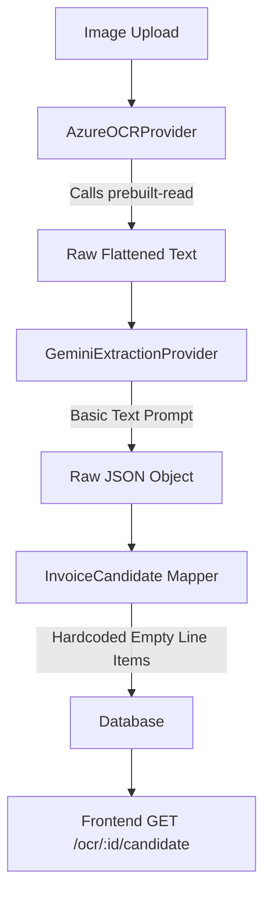

# OCR Accuracy Forensic Report

## 1. Architecture Diagram


## 2. Pipeline Trace
**Stage 1: Original Image**
- `images/Screenshot 2026-07-26 234527.png` (Shree Traders)

**Stage 2: Raw OCR Provider Response (Azure/Gemini Vision)**
```text
SHREE TRADERS
Wholesale & General Suppliers
45, Market Road, Pune - 411002, Maharashtra
Phone: 020-12345678 | Email: sales@shreetraders.in

TAX INVOICE

Invoice No.: ST/24-25/0115
GSTIN: 27ABCDE1234F1ZS
Date: 15/05/2024
Bill To: ABC SCHOOL ...
S.No. Description of Goods HSN/SAC Qty Rate Amount (₹)
1 A4 Size Paper (500 Sheets) 4802 10 250.00 2,500.00
2 HP Ink Cartridge 680 8443 2 950.00 1,900.00
3 Stapler Machine 8472 3 350.00 1,050.00
Subtotal 5,450.00
CGST @9% 490.50
SGST @9% 490.50
Round Off 0.00
Total ₹ 6,431.00
...
```

**Stage 3: AI Input**
```text
Extract the invoice details from the following OCR text:
[raw text above]
```

**Stage 4: AI Output (LLM JSON)**
```json
{
  "amount": 6431,
  "confidence": 0.95,
  "gstin": "27ABCDE1234F1ZS",
  "invoiceDate": "2024-05-15",
  "invoiceNumber": "ST/24-25/0115",
  "subtotal": 5450,
  "taxAmount": 981,
  "vendorName": "SHREE TRADERS"
}
```

**Stage 5 & 6: InvoiceCandidate & Database**
```json
{
  "vendorName": "SHREE TRADERS",
  "gstin": "27ABCDE1234F1ZS",
  "invoiceNumber": "ST/24-25/0115",
  "invoiceDate": "2024-05-15",
  "amount": 6431,
  "taxAmount": 981,
  "lineItems": [],
  "confidence": 0.95,
  "confidenceFactors": {}
}
```

**Stage 7: Frontend Payload**
Identical to Stage 6.

## 3. Field-by-Field Comparison

| Field | Original Invoice | Raw OCR | LLM Output | InvoiceCandidate |
|---|---|---|---|---|
| **Vendor Name** | SHREE TRADERS | Correct | SHREE TRADERS | SHREE TRADERS |
| **GSTIN** | 27ABCDE1234F1ZS | Correct | 27ABCDE1234F1ZS | 27ABCDE1234F1ZS |
| **PAN** | N/A | N/A | **Missing** | **Missing** |
| **Invoice Number**| ST/24-25/0115 | Correct | ST/24-25/0115 | ST/24-25/0115 |
| **Invoice Date** | 15/05/2024 | Correct | 2024-05-15 | 2024-05-15 |
| **Subtotal** | 5,450.00 | Correct | 5450 | 5450 |
| **Tax** | 981.00 (CGST+SGST) | Correct | 981 | 981 |
| **Total** | 6,431.00 | Correct | 6431 | 6431 |
| **Line Items** | 3 Items | Correct | **Omitted** | **Empty Array `[]`** |

## 4. Loss Analysis
1. **Line Items Loss**: The `GeminiExtractionProvider` JSON Schema passed to the LLM **does not include** a `lineItems` property. As a result, the LLM physically cannot output line items. Furthermore, the mapper code explicitly hardcodes `lineItems: []`.
2. **PAN Loss**: The `PAN` field is completely missing from the schema definition.
3. **Table Structure Loss**: The `AzureOCRProvider` currently uses `prebuilt-read` which strips all positional coordinates, layout boxes, and tabular structures, turning the invoice into a flat string of words. While this doesn't explicitly fail for simple invoices, it creates massive hallucination risks for multi-page complex tabular invoices.

## 5. OCR Model Audit
- **Current Model**: `prebuilt-read` (Azure Document Intelligence)
- **Status**: Suboptimal for structured invoices. `prebuilt-read` only extracts raw text lines.
- **Better Alternative Existing**: Azure offers `prebuilt-invoice` specifically for this domain, which extracts key-value pairs, line items, and layouts directly out-of-the-box without needing an LLM to guess the structure from a flattened string.

## 6. Prompt Audit
- **Techniques Used**: ONLY flattened text.
- **Techniques Missing**: Layout data, tables, bounding boxes, key-value pairs, reading order, reasoning instructions.
- The prompt is literally: `"Extract the invoice details from the following OCR text:\n\n${rawText}"`. It provides zero guidance on how to handle edge cases, multiple tax fields, or line items.

## 7. Top Reasons for Accuracy Loss
1. **Schema Truncation**: Line items are omitted from the LLM prompt schema entirely.
2. **Hardcoded Overrides**: The parser forcefully returns `lineItems: []`.
3. **Improper Azure Model**: Using `prebuilt-read` instead of `prebuilt-invoice` destroys the table layouts before they even reach the AI.
4. **Poor Prompt Design**: The prompt lacks reasoning rules, mapping rules, and field guidelines.
5. **Loss of Multimodal Context**: The system converts the image to text, then feeds the text to a multimodal LLM (Gemini), totally ignoring the original visual structure.

## 8. Concrete Recommendations (DO NOT IMPLEMENT YET)
1. Switch `AzureOCRProvider` from `prebuilt-read` to `prebuilt-invoice` or `prebuilt-layout` to retain table definitions.
2. Update the Gemini Schema in `GeminiExtractionProvider` to include `lineItems` with `hsn`, `quantity`, `rate`, and `amount`.
3. Update the parser mapping to extract `lineItems` instead of hardcoding `[]`.
4. Add `PAN` to the schema and parser.
5. Enhance the system prompt to include explicit instructions for GST calculation, CGST/SGST aggregation, and line-item bounds.
