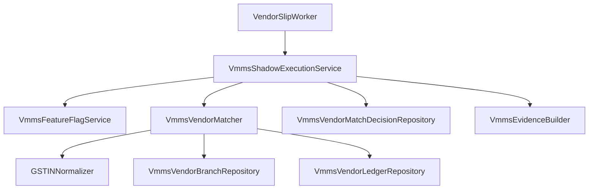

# Phase B Implementation Plan V2.0 (Frozen Contract)

## 1. Folder Structure
The implementation will introduce a dedicated VMMS directory within the vendor-slip module to strictly isolate it from legacy code.

```text
apps/backend/src/modules/vendor-slip/
├── vmms/
│   ├── config/
│   │   └── vmms-feature-flag.service.ts
│   ├── domain/
│   │   ├── models/
│   │   │   ├── vmms-match-result.ts
│   │   │   ├── vmms-match-stage.enum.ts
│   │   │   ├── vmms-match-reason.enum.ts
│   │   │   └── ledger-resolution-result.ts
│   │   ├── services/
│   │   │   ├── vmms-matcher.service.ts
│   │   │   ├── gstin-normalizer.service.ts
│   │   │   ├── vmms-evidence-builder.ts
│   │   │   └── vmms-shadow-execution.service.ts
│   │   └── repositories/
│   │       ├── vmms-vendor-branch.repository.ts
│   │       ├── vmms-vendor-ledger.repository.ts
│   │       └── vmms-vendor-match-decision.repository.ts
│   └── tests/
│       ├── unit/
│       └── integration/
```

## 2. Class Diagram
- **`VmmsFeatureFlagService`**: Injected into orchestration layers. Resolves configuration logic.
- **`GSTINNormalizer`**: Stateless utility class for deterministic OCR cleanup.
- **`VmmsEvidenceBuilder`**: Fluid builder pattern for constructing `matchEvidence` JSON deterministically.
- **`VmmsVendorMatcher`**: Core matching logic. Depends on `GSTINNormalizer`, `VmmsVendorBranchRepository`, and `VmmsVendorLedgerRepository`. Returns `VmmsMatchResult`.
- **`VmmsShadowExecutionService`**: Orchestrator. Depends on `VmmsFeatureFlagService`, `VmmsVendorMatcher`, `VmmsEvidenceBuilder`, and `VmmsVendorMatchDecisionRepository`.
- **`VendorSlipWorker`**: Modified strictly to invoke `VmmsShadowExecutionService.executeShadowMode()` without catching VMMS errors or halting.

## 3. Dependency Graph

*Rule Enforced: `VendorSlipWorker` is strictly prohibited from querying VMMS Repositories directly. `VmmsVendorMatcher` is strictly prohibited from interacting with feature flags or dual-write decisions.*

## 4. Execution Sequence
1. `VendorSlipWorker` receives the `InvoiceCandidate` from the Queue.
2. `VendorSlipWorker` executes the legacy `matcher.match()` and retains the legacy result.
3. `VendorSlipWorker` invokes `VmmsShadowExecutionService.executeShadowMode(candidate, legacyResult)`.
4. `VmmsShadowExecutionService` evaluates `VmmsFeatureFlagService.isVmmsEnabled()`. If FALSE, returns immediately (logging `VMMS_DISABLED`).
5. If `isShadowMatcherEnabled()` is TRUE, it wraps execution in a `try/catch`.
6. `VmmsVendorMatcher` executes Stage 1 (Exact GSTIN) -> Stage 2 (Normalized GSTIN).
7. If a branch is matched, `VmmsVendorMatcher` queries `VmmsVendorLedgerRepository` for ledger resolution.
8. `VmmsVendorMatcher` returns the strongly typed `VmmsMatchResult`.
9. `VmmsShadowExecutionService` logs the result (e.g., `VMMS_STAGE1_MATCH`).
10. If `isDualWriteEnabled()` is TRUE, `VmmsShadowExecutionService` uses `VmmsEvidenceBuilder` to construct the payload and persists via `VmmsVendorMatchDecisionRepository`.
11. `VmmsShadowExecutionService` returns control to `VendorSlipWorker`.
12. `VendorSlipWorker` resumes legacy processing completely unaffected.

## 5. Feature Flag Matrix
| Flag | Master (`VMMS_ENABLED`) | Matcher | Dual Write | Debug | Expected Behavior |
| :--- | :--- | :--- | :--- | :--- | :--- |
| **All OFF** | `false` | `false` | `false` | `false` | Legacy only. `executeShadowMode` exits immediately. |
| **Silent Run** | `true` | `true` | `false` | `false` | VMMS matcher runs. Dual write is skipped. Observability logs only. |
| **Shadow Mode** | `true` | `true` | `true` | `false` | VMMS matcher runs. `VendorMatchDecision` is written to DB. Legacy proceeds. |
| **Precedence** | `false` | `true` | `true` | `true` | Legacy only. Master flag override forces all child flags to `false`. |

## 6. Failure Matrix
| Failure Scenario | VMMS Behavior | Legacy Pipeline Impact | Required Observability Event |
| :--- | :--- | :--- | :--- |
| `GSTINNormalizer` throws error | Caught by ShadowExecutor | ZERO | `VMMS_SHADOW_ERROR` |
| Database timeout on `VendorBranch` | Caught by ShadowExecutor | ZERO | `VMMS_SHADOW_ERROR` |
| `VendorLedger` lookup fails | Returns `LEDGER_SELECTION_REQUIRED` | ZERO | `VMMS_LEDGER_UNRESOLVED` |
| Dual-write DB insert fails | Caught by ShadowExecutor | ZERO | `VMMS_DUAL_WRITE_FAILED` |
| Legacy Matcher fails | N/A (Standard Error) | Fails / Manual Review | `LEGACY_MATCH_FAILED` |

## 7. Testing Matrix
- **Unit Tests:** `VmmsVendorMatcher`, `GSTINNormalizer`, `VmmsEvidenceBuilder`, `VmmsFeatureFlagService` testing precedence.
- **Repository Tests:** `VmmsVendorBranchRepository`, `VmmsVendorLedgerRepository`, `VmmsVendorMatchDecisionRepository`.
- **Shadow Execution Tests:** Validate that `VmmsShadowExecutionService` successfully swallows thrown errors and logs them, guaranteeing `VendorSlipWorker` never crashes.
- **Integration Tests:** Ensure `VendorSlipWorker` successfully dispatches legacy messages regardless of the feature flags configured.
- **Regression Tests:** Verify all existing 25 tests remain green without modification.

## 8. Risk Matrix
| Risk | Probability | Impact | Mitigation Strategy |
| :--- | :--- | :--- | :--- |
| Unhandled VMMS exception halts worker | Low | High | Strict `try-catch-log-swallow` wrapper inside `VmmsShadowExecutionService`. |
| DB Connection exhaustion | Low | Medium | VMMS queries utilize existing Prisma connection pool. Feature flags allow instant disable. |
| Dual-write transaction deadlocks | Low | Medium | Dual write occurs completely out-of-band (non-transactional) from legacy updates. |

## 9. Migration Impact
- **Schema:** Zero impact. Schema was finalized and certified in Phase A. No database migrations will be performed in Phase B.
- **Data:** Zero data mutation on legacy entities. Phase B only produces additive `VendorMatchDecision` records.

## 10. Performance Impact
- **Latency:** Minor increase (10-30ms) during shadow matching due to additional indexed DB reads.
- **Overhead:** B-Tree isolation indexes added in Phase A guarantee sub-millisecond lookup times for Exact GSTIN. Dual write incurs a negligible `INSERT` penalty. If performance degrades, master feature flag allows instantaneous disabling.
