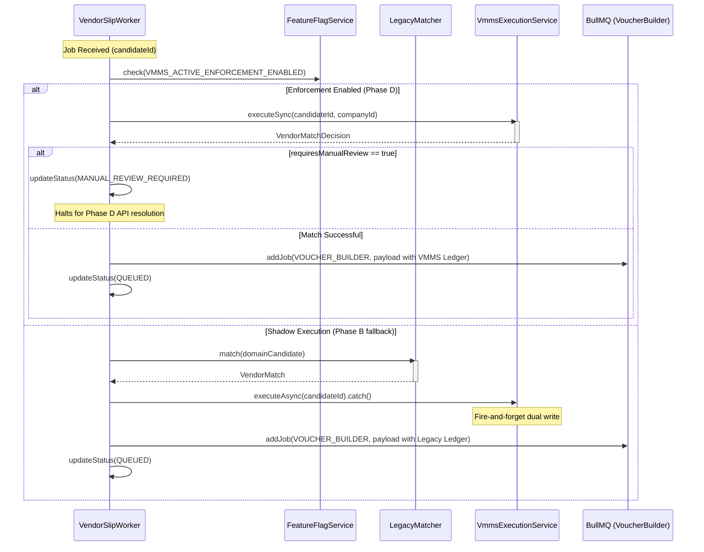

# Phase D Sequence Diagram

```mermaid
sequenceDiagram
    participant Worker as VendorSlipWorker
    participant Flags as FeatureFlagService
    participant Legacy as LegacyMatcher
    participant VMMS as VmmsExecutionService
    participant Queue as BullMQ (VoucherBuilder)

    Note over Worker: Job Received (candidateId)
    Worker->>Flags: check(VMMS_ACTIVE_ENFORCEMENT_ENABLED)
    
    alt Enforcement Enabled (Phase D)
        Worker->>VMMS: executeSync(candidateId, companyId)
        activate VMMS
        VMMS-->>Worker: VendorMatchDecision
        deactivate VMMS
        
        alt requiresManualReview == true
            Worker->>Worker: updateStatus(MANUAL_REVIEW_REQUIRED)
            Note over Worker: Halts for Phase D API resolution
        else Match Successful
            Worker->>Queue: addJob(VOUCHER_BUILDER, payload with VMMS Ledger)
            Worker->>Worker: updateStatus(QUEUED)
        end
        
    else Shadow Execution (Phase B fallback)
        Worker->>Legacy: match(domainCandidate)
        activate Legacy
        Legacy-->>Worker: VendorMatch
        deactivate Legacy
        
        Worker->>VMMS: executeAsync(candidateId).catch()
        Note over VMMS: Fire-and-forget dual write
        
        Worker->>Queue: addJob(VOUCHER_BUILDER, payload with Legacy Ledger)
        Worker->>Worker: updateStatus(QUEUED)
    end
```
