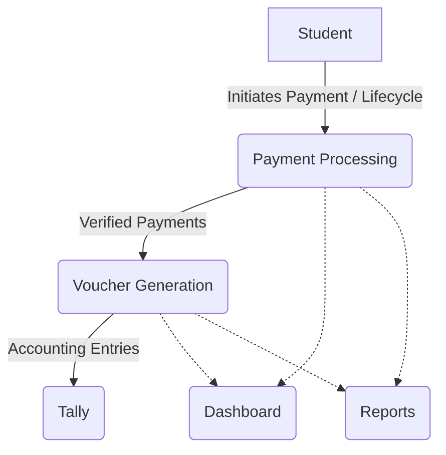
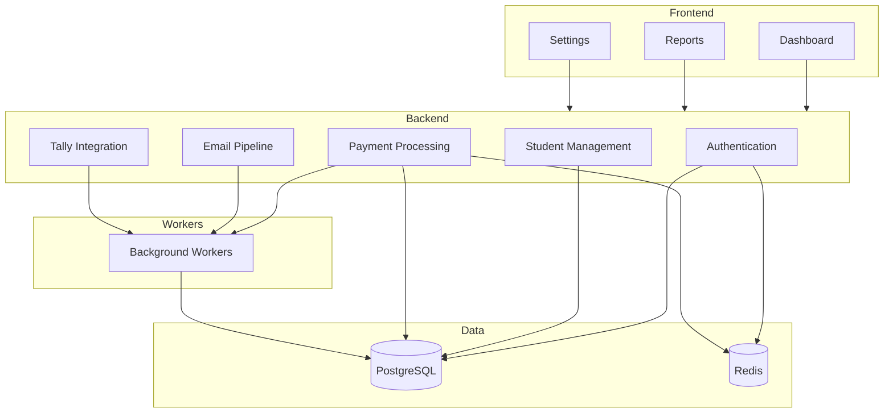

# TallyMe Software Design Specification (SDS)
## Master Architecture Index

### Purpose
This document acts as the single entry point into the entire TallyMe architecture. It connects every architecture document into one coherent software specification. It serves as the official reference during implementation.

---

### 1. Executive Summary

TallyMe is an enterprise-grade automated accounting and fee management platform designed specifically for educational institutions.

- **Problem**: Schools manage vast amounts of fragmented financial data across disconnected systems (fee collection, vendor bills, bank statements), requiring manual reconciliation and data entry into accounting systems like Tally ERP.
- **Solution**: A unified platform that automates voucher generation, integrates payment pipelines, and provides straight-through processing to accounting ledgers with AI-assisted reconciliation.
- **Goals**: Eliminate manual accounting entry, reduce reconciliation errors to zero, provide real-time financial visibility, and maintain a rigorous audit trail of all transactions.
- **Scope**: End-to-end payment processing, student lifecycle financial tracking, document-based automated invoice processing, and bidirectional synchronization with ERP systems.
- **Users**: School Administrators, Finance Officers, Auditors, and Parents.

---

### 2. Product Overview

| Module | Purpose | Dependencies | Status |
|--------|---------|--------------|--------|
| Authentication | Manages identity, OAuth integration, and RBAC | Core Platform | Frozen |
| Student Management | Tracks student lifecycles, promotions, and academic details | Authentication | Frozen |
| Payment Processing | Handles fee collections, payment pipelines, and reconciliation | Authentication, Student Management | Frozen |
| Settings | Centralized configuration for school parameters and global preferences | Core Platform | Frozen |
| Dashboard | Real-time analytics and consolidated financial operational views | All Modules | Frozen |
| Reports | Generates exportable financial, audit, and operational reports | All Modules | Frozen |
| Infrastructure | Core system services including caching, queuing, and storage | None | Frozen |

---

### 3. System Architecture Overview



---

### 4. Architecture Principles

- **Configuration over hardcoding**: Externalize all environment-specific and tenant-specific variables.
- **CQRS where appropriate**: Separate read-heavy dashboard and reporting pipelines from transactional business logic.
- **Event Driven**: Use domain events to orchestrate workflows across isolated boundaries.
- **RBAC**: Enforce granular role-based access control at the API gateway and use case boundaries.
- **Layered Architecture**: Strictly isolate Presentation, Application, Domain, and Infrastructure layers.
- **SOLID**: Follow object-oriented design principles to ensure maintainable, extensible code.
- **Clean Architecture**: Domain models and use cases must depend on nothing outside the core.
- **Stateless Services**: Design application services to be completely stateless to enable horizontal scaling.
- **Security First**: Default-deny access, strict input validation, and comprehensive audit logging.
- **Scalability**: Design for multi-tenancy and high throughput without compromising data integrity.

---

### 5. Module Dependency Graph



---

### 6. Event Catalog

| Domain Event | Publisher | Consumers | Purpose |
|--------------|-----------|-----------|---------|
| `PaymentReceived` | Payment Gateway Webhook | Payment Engine, Audit Log | Indicates a raw payment payload has arrived. |
| `PaymentValidated` | Payment Engine | Reconciliation Engine | Confirms payment matches system constraints. |
| `PaymentMatched` | Reconciliation Engine | Ledger | Confirms payment correlates to an outstanding fee. |
| `PaymentAllocated` | Ledger | Voucher Generator | Triggers accounting entry generation. |
| `VoucherGenerated` | Voucher Generator | Tally Sync Engine | Prepares structured data for ERP transmission. |
| `VoucherSynced` | Tally Sync Engine | Audit Log, Notifications | Confirms successful receipt by ERP. |
| `StudentCreated` | Student Management | Identity Provider, Ledger | Initializes a new student profile and ledger. |
| `StudentPromoted` | Student Management | Fee Calculator | Triggers structural changes to upcoming fees. |
| `FeeStructureAssigned` | Setting/Fee Management | Ledger | Generates required receivables for a student. |
| `DiscountApplied` | Administrator Action | Ledger | Adjusts the expected receivable amount. |
| `ConfigurationChanged` | Settings | All Services (Cache Invalidation) | Updates tenant-wide parameters. |
| `ReportGenerated` | Reporting Engine | Notifications | Notifies user that asynchronous report is ready. |
| `UserLoggedIn` | Authentication | Audit Log | Tracks identity session initiation. |
| `PasswordResetRequested` | Authentication | Email Pipeline | Triggers secure token distribution. |
| `OAuthConnected` | Authentication | Integration Engine | Establishes external API integration. |
| `OAuthExpired` | Integration Engine | Notifications | Alerts administrators to re-authenticate. |

---

### 7. API Standards

- **REST Conventions**: Strict adherence to HTTP methods (GET, POST, PUT, PATCH, DELETE) and resource-based URI structures.
- **Versioning**: API versioning managed via URI (`/api/v1/resource`) to ensure backward compatibility.
- **Pagination**: Offset-based or cursor-based pagination for all collection endpoints (`?limit=50&cursor=XYZ`).
- **Filtering**: Standardized query string filtering formats (`?status=active&type=receipt`).
- **Sorting**: Consistent sorting parameters (`?sort=-createdAt`).
- **Error Format**: Standardized RFC 7807 Problem Details JSON format for all error responses.
- **Validation**: Strict JSON Schema validation on all inbound requests; invalid payloads yield 400 Bad Request immediately.
- **Idempotency**: All mutating requests (POST/PUT/PATCH) require an `Idempotency-Key` header to prevent duplicate processing.
- **Response Envelope**: Standard envelope encapsulating `data` and `meta` (for pagination, metrics).

---

### 8. Coding Standards

- **Folder Structure**: Strict adherence to the established Clean Architecture layer layout per bounded context.
- **Naming Conventions**: `camelCase` for variables/functions, `PascalCase` for classes/interfaces, `kebab-case` for file names.
- **Class Naming**: Suffix classes with their architectural role (e.g., `PaymentService`, `StudentRepository`, `ProcessPaymentUseCase`).
- **DTO Naming**: Suffix data transfer objects explicitly (e.g., `CreateStudentDto`, `PaymentResponseDto`).
- **Entity Naming**: Core domain entities are noun-based, without suffixes (e.g., `Student`, `Voucher`).
- **Enum Naming**: PascalCase for enum types, UPPER_SNAKE_CASE for members.
- **File Naming**: Mirror the exported class/function name in `kebab-case`.
- **Imports**: Absolute imports defined via path aliases (`@/modules/auth/...`); no relative deep paths.
- **Comments**: JSDoc required for all public API boundaries, use cases, and complex algorithmic logic. Why over what.
- **Testing**: Co-locate unit tests with implementation (`*.spec.ts`).
- **Error Handling**: Use custom domain exceptions; never throw generic `Error` objects; catch and translate at infrastructure boundaries.

---

### 9. Repository Structure

```text
tallyme/
├── apps/
│   ├── backend/
│   ├── frontend/
│   └── workers/
├── shared/
│   ├── config/
│   └── types/
├── docs/
│   ├── architecture/
│   ├── api/
│   └── ...
├── scripts/
├── tests/
│   ├── e2e/
│   └── integration/
└── package.json
```

---

### 10. Technology Stack

| Component | Technology |
|-----------|------------|
| **Frontend** | React, Next.js (App Router), TailwindCSS, TypeScript |
| **Backend** | NestJS, Node.js, TypeScript |
| **Database** | PostgreSQL (Relational Data & Event Store) |
| **Redis** | Redis (Caching, Rate Limiting, Session State) |
| **Queue** | BullMQ (Asynchronous processing) |
| **Authentication** | Custom JWT + OAuth 2.0 Integration |
| **Storage** | S3-compatible Object Storage |
| **Charts** | Recharts / Chart.js |
| **Forms** | React Hook Form + Zod |
| **Validation** | Zod / class-validator |
| **Deployment** | Docker, Kubernetes (or AWS ECS) |
| **Monitoring** | Prometheus / Grafana / OpenTelemetry |
| **Logging** | Winston (Structured JSON logging), ELK Stack |
| **Testing** | Jest, Supertest, Cypress/Playwright |

---

### 11. Security Standards

- **Authentication**: Stateless JWT with short expiration and secure HTTP-only refresh tokens.
- **Authorization**: Attribute-based and Role-based access control (RBAC) enforced at the resolver/controller level.
- **Encryption**: TLS 1.3 in transit; AES-256-GCM for sensitive fields (API keys, tokens) at rest.
- **Secrets**: Environment variables strictly managed via secure vaults (e.g., AWS Secrets Manager); never hardcoded.
- **OAuth**: Strict adherence to OAuth 2.0 flows for external integrations (e.g., Google Workspace) with minimal scopes.
- **Rate Limiting**: Distributed Redis-based sliding window rate limiting applied to all public API endpoints.
- **Audit Logs**: Immutable, append-only audit trail capturing `actor`, `action`, `resource`, `timestamp`, and `IP`.
- **PII Protection**: Data masking in logs; selective encryption for sensitive student and financial data.

---

### 12. Performance Standards

- **Caching**: Aggressive caching of static configurations, read models, and frequently accessed aggregates.
- **Queue Processing**: Offload all heavy computation (PDF generation, ERP sync, email parsing) to background workers.
- **Database Optimization**: Strict indexing strategies on foreign keys and querying fields; query execution time limits.
- **Lazy Loading**: Paginated list views; deferral of heavy resource loading until explicitly requested by the client.
- **Streaming**: Stream large data exports (CSV, PDF reports) directly to the client rather than buffering in memory.
- **Background Jobs**: Idempotent, retryable jobs with exponential backoff and dead-letter queues for failure handling.

---

### 13. Scalability Strategy

- **100 students**: Single monolithic deployment with shared database.
- **1,000 students**: Vertical scaling of database; introduction of read-replicas for heavy reporting.
- **10,000 students**: Horizontal scaling of stateless API nodes and background workers; Redis cluster integration.
- **100,000 students**: Partitioning/Sharding of PostgreSQL database by tenant/school; dedicated worker pools by priority.
- **Multiple schools**: Tenant isolation via Row-Level Security (RLS) or schema-per-tenant architecture.
- **Future SaaS**: Fully multi-tenant cloud-native architecture spanning multiple availability zones.

---

### 14. Development Workflow

- **Phase 1**: Foundation
- **Phase 2**: Authentication
- **Phase 3**: Student Management
- **Phase 4**: Payment Processing
- **Phase 5**: Dashboard
- **Phase 6**: Reports
- **Phase 7**: Settings
- **Phase 8**: Integration
- **Phase 9**: Testing
- **Phase 10**: Deployment

---

### 15. Testing Strategy

- **Unit Tests**: Domain entities, value objects, and pure utility functions. Target: 90%+ coverage for Domain logic.
- **Integration Tests**: Database repositories, external API adapters, cache interactions.
- **E2E Tests**: Critical user journeys (e.g., Payment to Voucher generation flow).
- **Performance Tests**: Load testing core API routes and worker queues.
- **Security Tests**: Automated SAST, DAST, and dependency vulnerability scanning in CI/CD pipeline.
- **Manual Testing**: User acceptance testing (UAT) focusing on UX fidelity and edge-case operational workflows.

---

### 16. Architecture Decision Records (ADR)

| Decision | Reason |
|----------|--------|
| **Next.js instead of React SPA** | Improved SEO, structured routing, and unified build process. |
| **NestJS instead of Express** | Enforces scalable structural patterns, DI, and TypeScript first. |
| **BullMQ instead of RabbitMQ** | Leverages existing Redis infrastructure, simpler operational overhead. |
| **PostgreSQL instead of MySQL** | Superior support for JSONB, robust constraints, and extensibility. |
| **OAuth instead of IMAP Passwords** | Enhanced security posture, revocable access, no stored credentials. |
| **CQRS for Dashboard** | Decouples read-heavy reporting from critical path transactional logic. |
| **Redis for Cache** | Proven reliability for session state, rate limiting, and BullMQ backend. |
| **Versioned Fee Structures** | Allows retroactive audits and prevents historical data mutation when prices change. |

---

### 17. Glossary

- **Aggregate**: A cluster of domain objects that can be treated as a single unit (e.g., Student).
- **Read Model**: A data structure pre-optimized for querying, separated from the write model.
- **CQRS**: Command Query Responsibility Segregation; separating read operations from write operations.
- **BullMQ**: A Redis-based message queue system for handling asynchronous background jobs.
- **Voucher**: A canonical document representing an accounting transaction ready for ERP ingestion.
- **Fee Head**: A categorized classification of a charge (e.g., Tuition, Transportation).
- **Installment**: A scheduled portion of a larger fee structure due at a specific date.
- **Outstanding Balance**: The net unpaid amount attached to a student's ledger.
- **Manual Review**: A system state where automated processing fails confidence thresholds, requiring human intervention.
- **DLQ**: Dead Letter Queue; storage for messages/jobs that repeatedly fail processing.
- **Materialized View**: A database object that contains the results of a query, heavily used for reporting.

---

### 18. Future Roadmap

- **AI Matching**: Machine learning algorithms to automatically reconcile ambiguous bank statement entries.
- **Predictive Analytics**: Forecasting cash flows and predicting delayed payments based on historical trends.
- **Parent Portal**: Dedicated interface for parents to view statements and initiate online payments.
- **Multi School**: Extending the architecture to support organizational hierarchies (trusts/districts).
- **SaaS**: Transitioning the platform to a self-serve subscription model.
- **Plugin Marketplace**: Architecture for third-party developers to build custom integrations.
- **Custom Reports**: User-defined report builders with drag-and-drop metric selection.
- **Mobile App**: Native or PWA companion application for on-the-go dashboard insights.

---

### 19. Document Index

- Product Foundation
- Backend Architecture
- Frontend Architecture
- UI/UX Architecture
- Design System
- Authentication
- Student Management
- Payment Processing
- Settings
- Dashboard
- Reports
- Infrastructure
- **This Master SDS**

---

### 20. Final Implementation Readiness Checklist

- [x] Architecture Complete
- [x] Requirements Frozen
- [x] Technology Stack Selected
- [x] Folder Structure Approved
- [x] Coding Standards Approved
- [x] Security Model Approved
- [x] Deployment Strategy Approved
- [x] Ready for Database Design
- [x] Ready for Backend Development
- [x] Ready for Frontend Development

==================================================
